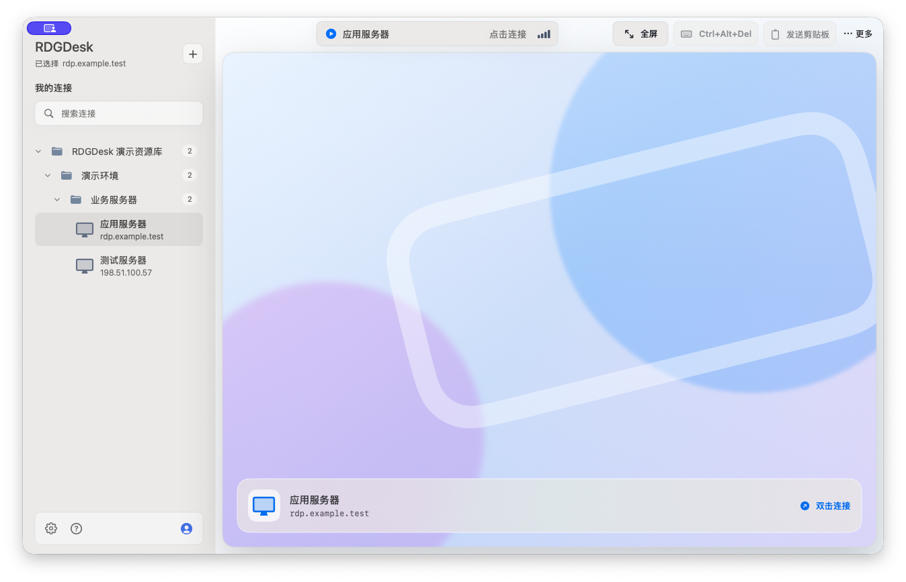
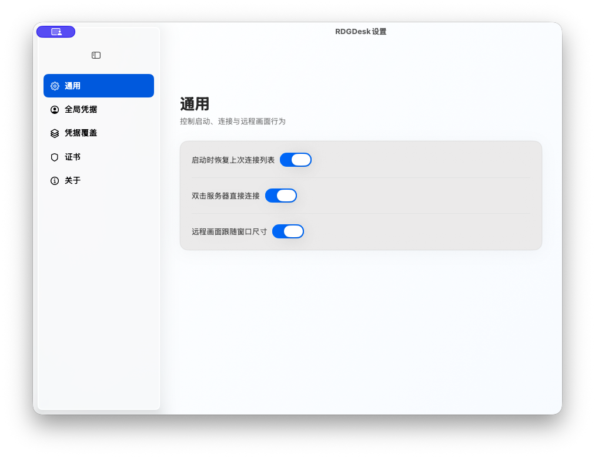
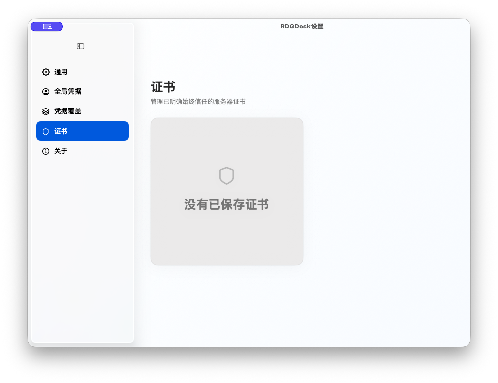
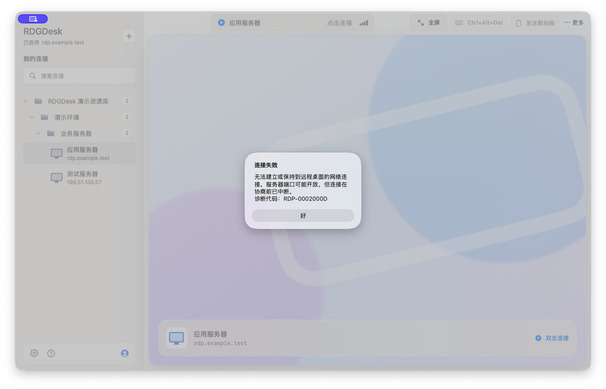

# RDGDesk

[简体中文](README.md) | **English**

RDGDesk is an independent native macOS remote desktop client compatible with `.rdg` libraries exported by Microsoft Remote Desktop Connection Manager (RDCMan). Remote sessions are powered by embedded FreeRDP.

> Current target: Apple silicon Macs running macOS 26 or later. The project is under active development; review the security model and test with non-production systems before relying on it for critical access.

## Interface preview



| General settings | Certificate management | Connection diagnostics |
| --- | --- | --- |
|  |  |  |

## Current capabilities

- Import, search, restore, and browse sanitized RDCMan-compatible libraries.
- Connect in the native canvas and forward pointer, wheel, scan-code keyboard, Chinese IME/Unicode, focus, full-screen, and resize events.
- Send `Ctrl+Alt+Del`, explicitly send the local text clipboard, and receive remote text clipboard updates. Clipboard transfer is text-only and limited to 1 MB; local text is never sent automatically.
- Save global, group, and server credentials. Passwords are generic-password items in macOS Keychain; the JSON configuration stores only non-sensitive metadata and bindings.
- Resolve credentials in this order: server override, nearest group, parent groups, global credential, then a one-time prompt.
- Require an explicit certificate decision on first use or when a fingerprint changes. `信任一次` applies only to the current attempt; `始终信任` saves the endpoint SHA-256 pin; `取消` rejects the connection. A matching saved pin reconnects without a sheet.
- Classify DNS, timeout, refused connection, TLS/protocol, certificate, authentication, remote-disconnect, Keychain, and configuration failures separately.

RDCMan passwords protected by Windows DPAPI are never decrypted on macOS and are removed from the restored local snapshot.

## Running the app

Install the build prerequisites first:

```bash
brew install cmake ninja pkg-config openssl@3
./scripts/bootstrap-freerdp.sh
```

From this directory:

```bash
./scripts/run.sh
```

Import an `.rdg` file from the sidebar, select a server, and click `连接`. Open `RDGDesk > 设置…` or use the sidebar gear for:

- `通用`: restore the last library, double-click connection, and follow-window resize.
- `全局凭据`: save, update, or remove the inherited Keychain credential.
- `凭据覆盖`: search groups/servers, set an override, or restore inheritance.
- `证书`: inspect or remove saved endpoint pins for future connections.
- `关于`: version and privacy information.

The debug-only `使用外部客户端调试` action creates a temporary `.rdp` file. Ordinary connections always use embedded FreeRDP.

## Creating a self-use app

```bash
RDC_SWIFTPM_DISABLE_SANDBOX=1 ./scripts/package-app.sh --dmg
```

This creates `dist/RDGDesk.app` and `dist/RDGDesk.dmg`, bundles the FreeRDP/OpenSSL runtime libraries and their license texts, and applies an ad-hoc signature. It is intended for the owner's Macs. Because it is not Developer ID signed or notarized, macOS may require Control-clicking the app and choosing `打开` on first launch. Public distribution requires a paid Apple Developer identity, hardened-runtime signing, notarization, and a release-specific third-party dependency audit.

## Development and verification

```bash
./scripts/test.sh
./scripts/test-bootstrap-freerdp.sh all
./scripts/build.sh
bash -n scripts/*.sh
```

In a managed environment that blocks nested `sandbox-exec`, use:

```bash
RDC_SWIFTPM_DISABLE_SANDBOX=1 ./scripts/build.sh
./scripts/test.sh --disable-sandbox
```

Real-server coverage is opt-in and requires all of `RDC_TEST_HOST`, `RDC_TEST_PORT`, `RDC_TEST_USER`, `RDC_TEST_DOMAIN`, `RDC_TEST_PASSWORD`, and `RDC_TEST_EXPECTED_SHA256` (uppercase or lowercase colon-delimited SHA-256). Missing or invalid configuration never prints environment values. Real Keychain integration is separately enabled with `RDC_TEST_KEYCHAIN=1`; it uses random `integration-<UUID>` item IDs and cleans them up.

Private large-library acceptance coverage is opt-in with `RDC_TEST_RDG_PATH=/absolute/path/to/library.rdg`. Never commit a real `.rdg` file: it may contain internal hostnames, server addresses, usernames, and Windows DPAPI ciphertext.

No password should be placed in source files, fixtures, command output, issue reports, or verification documents. Enter real credentials only in your local environment or the app's secure UI.

## Project shape

- `Sources/RdcApp`: SwiftUI/AppKit application, settings, credential, certificate, and remote-canvas UI.
- `Sources/RdcCore`: parser, sanitized persistence, Keychain vault, trust coordination, and embedded session engine.
- `Tests/RdcCoreTests`: deterministic unit and loopback coverage.
- `Tests/RdcAppTests`: application workflow and presentation coverage.
- `Tests/RdcFreeRDPIntegrationTests`: deterministic changed-pin tests plus opt-in real server and Keychain workflows.
- `scripts`: repeatable bootstrap, build, run, test, and scope-validation commands.

## Security

Please report vulnerabilities privately as described in [SECURITY.md](SECURITY.md). Do not include real credentials, `.rdg` files, certificate pins, server addresses, or connection logs in public issues.

## Compatibility and trademarks

RDGDesk is an independent project. It is not affiliated with, sponsored by, endorsed by, or distributed by Microsoft. Microsoft, Windows, Remote Desktop Connection Manager, RDCMan, and other Microsoft product names are used only in plain text to describe file-format and protocol compatibility; the corresponding names and trademarks belong to their respective owners.

RDGDesk does not include Microsoft logos, Windows interface artwork, RDCMan binaries, or Microsoft source code.

See [TRADEMARKS.md](TRADEMARKS.md) for the standalone trademark notice.

## License and third-party software

RDGDesk source code is available under the [MIT License](LICENSE). It integrates with FreeRDP and OpenSSL; see [THIRD_PARTY_NOTICES.md](THIRD_PARTY_NOTICES.md) for attribution and redistribution notes.
